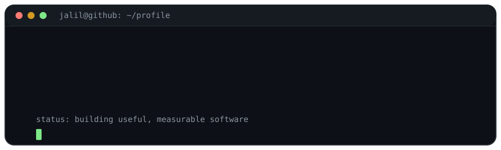

# Jalil Ahmad Afshar

I am a computer engineering student and a Python-focused developer working across
machine learning research, full-stack platforms, backend systems, and developer
tools.

&nbsp;

 

<pre align="left">
$ whoami
jalil@github:~$ python profile.py

role      : Python Developer / ML Researcher
focus     : Research systems, educational platforms, practical tools
principle : Make the data traceable. Test the boundary. Report honestly.

jalil@github:~$ _
</pre>

 

## About

I build software that connects research, data, and real workflows.

My recent work includes an auditable financial-machine-learning research pipeline,
education and school-management platforms, a Windows networking utility, search
and chatbot experiments, algorithm visualizations, and embedded systems with
ESP32.

I enjoy taking an idea from an unclear requirement to a working system: defining
the data contract, separating responsibilities, testing the important boundaries,
and documenting what the results actually support.

 

## Current Focus

### HGE Gold Forecasting

An audit-first research project, undergraduate thesis, and accompanying article
on multi-horizon daily XAUUSD direction forecasting.

The work combines causal Hurst/DFA regime features, chronological and purged
validation, controlled ablation studies, block-aware uncertainty estimates,
reproducible artifacts, and fixed-signal MetaTrader 5 replay.

The result is intentionally reported with scientific caution: the documented
evaluation did not demonstrate stable incremental value from Hurst features, and
the project is research software—not investment advice.

### Education and School Platforms

I have worked on full-stack systems for school operations, academic data, content,
reporting, and educational workflows.

The projects use combinations of Django/DRF or FastAPI, Next.js and TypeScript,
PostgreSQL, Redis, Celery, Docker, REST/OpenAPI contracts, role-scoped access,
data import pipelines, and automated tests.

 

## Selected Projects

<table>
<tr>
<td width="50%" valign="top">

### [HGE Gold Forecasting](https://github.com/leonardo0231/hurst-gated-gold-forecasting)

Leakage-controlled research software for multi-horizon XAUUSD direction
forecasting, with causal features, purged walk-forward validation, ablation
studies, reproducible evidence, and MetaTrader 5 replay.

<code>Python</code> <code>Machine Learning</code> <code>Time Series</code> <code>Finance</code> <code>MT5</code>

</tr>

<tr>
<td width="50%" valign="top">

### [Financial-market](https://github.com/leonardo0231/Financial-market)

An experimental XAU/USD trading system combining Python, MetaTrader 5, n8n
workflow automation, Telegram control, strategy management, and risk controls.

<code>Python</code> <code>MT5</code> <code>Redis</code> <code>PostgreSQL</code> <code>n8n</code>

</td>

<td width="50%" valign="top">

### [Study Assistant](https://github.com/leonardo0231/study-assistant)

A FastAPI chatbot that uses sentence embeddings and FAISS vector similarity
search to retrieve answers from educational content.

<code>Python</code> <code>FastAPI</code> <code>NLP</code> <code>FAISS</code> <code>Vector Search</code>

</td>
</tr>

<tr>
<td width="50%" valign="top">

### [House Price Prediction](https://github.com/leonardo0231/House_Price_Prediction)

A machine-learning project focused on preprocessing, feature engineering, model
comparison, and regression for housing-price prediction.

<code>Python</code> <code>Pandas</code> <code>NumPy</code> <code>Scikit-learn</code>

</td>

<td width="50%" valign="top">

### [PersonalBlogHub](https://github.com/leonardo0231/PersonalBlogHub)

A Django-based blogging platform with user flows, blog management, templates,
static assets, and application-level tests.

<code>Python</code> <code>Django</code> <code>HTML</code> <code>CSS</code>

</td>
</tr>
</table>

 

## Other Work

- **Regex Engine Visualizer** — converts regular expressions to NFA with
  Thompson's Construction, converts NFA to DFA with Subset Construction, and
  visualizes the resulting automata with Graphviz.
- **ESP32 Smart Lighting** — a PIR-based lighting controller with automatic
  timeout, manual override, button debouncing, and serial diagnostics.
- **Othello Game, data-cleaning notebooks, Django REST experiments, and small
  web projects** — hands-on projects used to practice algorithms, APIs, data
  preparation, and software design.

 

## Core Stack

### Languages

### AI and Data

### Web and Backend

### Engineering and Delivery

REST APIs · OpenAPI · Docker Compose · Celery · n8n · MetaTrader 5 · Graphviz · ESP32

 

## Areas of Interest

<pre>
Applied ML and Research
├── Time-Series Forecasting
├── Financial Machine Learning
├── Point-in-Time Data and Leakage Control
├── Model Evaluation and Uncertainty
└── Reproducible Experiments

Product and Platform Engineering
├── Python Backend Systems
├── REST APIs and OpenAPI Contracts
├── Next.js and TypeScript Applications
├── Authentication and Role-Based Access
└── Data Import and Workflow Automation

Systems and Algorithms
├── Windows Desktop and Networking Tools
├── Automata and Compiler Concepts
├── IoT and ESP32
└── Developer Utilities
</pre>

 

## Working Philosophy

> Define the contract.
>
> Make the data traceable.
>
> Test the boundary.
>
> Report the result honestly.

 

### Building software that is useful, measurable, and honest about its limits.

[GitHub](https://github.com/leonardo0231) · [LinkedIn](https://linkedin.com/in/jalil-ahmad-afshar-055a98186)

